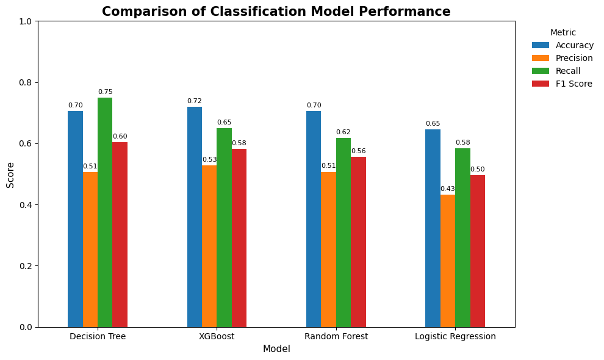
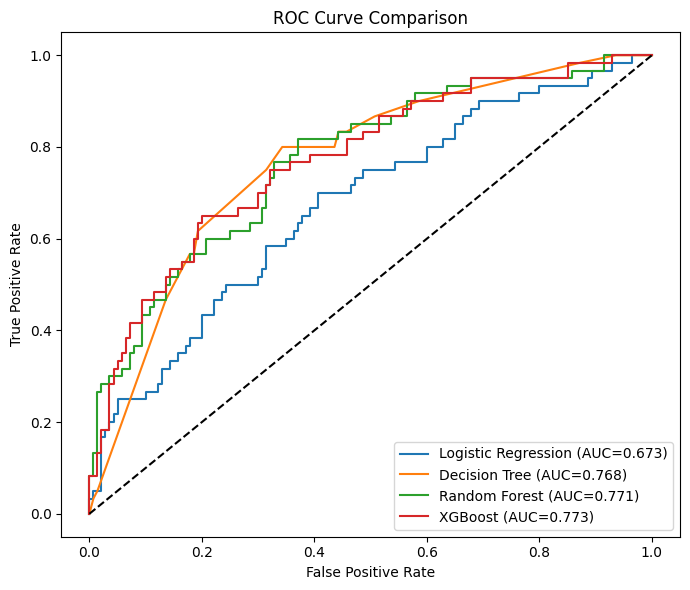

# Credit Risk Prediction Using Machine Learning

## Project Overview

This project aims to predict credit risk by applying multiple machine learning classification algorithms to the German Credit dataset. The workflow includes exploratory data analysis (EDA), feature engineering, correlation analysis, model development, model evaluation, and business recommendations.

Four classification models were implemented and compared:

- Logistic Regression
- Decision Tree
- Random Forest
- XGBoost

The objective is to identify applicants with a high probability of bad credit risk while comparing the strengths and weaknesses of different machine learning approaches.

---

## Dataset

**Dataset:** German Credit Data

The dataset contains demographic and financial information about loan applicants, including:

- Age
- Job
- Credit Amount
- Loan Duration
- Checking Account Status
- Saving Account Status
- Housing
- Loan Purpose
- Credit Risk (Target Variable)

Target variable:

- Good Credit Risk = 0
- Bad Credit Risk = 1

---

## Project Workflow

```
Exploratory Data Analysis (EDA)
                │
                ▼
      Feature Engineering
                │
                ▼
      Correlation Analysis
                │
                ▼
      Machine Learning Models
      ├── Logistic Regression
      ├── Decision Tree
      ├── Random Forest
      └── XGBoost
                │
                ▼
      Model Performance Comparison
                │
                ▼
     Business Recommendations
```

---

## Repository Structure

```
credit_risk_scoring_machine_learning/

│
├── german_credit_data.csv
├── credit_risk_scoring.ipynb
├── model_performance_comparison.png
├── roc_curve_comparison.png
└── README.md
```

---

## Model Performance Comparison



The comparison shows that tree-based models consistently outperform Logistic Regression. XGBoost achieves the highest Accuracy and Precision, while Decision Tree provides the highest Recall and F1 Score for identifying bad credit applicants.

---

## ROC Curve Comparison



The ROC curves indicate that XGBoost achieves the highest discrimination capability (AUC = 0.773), closely followed by Random Forest and Decision Tree. Logistic Regression serves as a simple baseline model with comparatively lower predictive performance.

---

## Key Findings

- Checking Account Status is the most influential predictor across all tree-based models.
- Loan Duration and Credit Amount consistently rank among the most important features.
- Tree-based algorithms outperform Logistic Regression across almost all evaluation metrics.
- XGBoost provides the best overall predictive performance.
- Decision Tree achieves the highest Recall for identifying bad credit applicants.

---

## Business Recommendations

Financial institutions should place greater emphasis on applicants' checking account status, loan duration, and requested credit amount during the credit evaluation process.

Model selection should depend on the business objective:

- **XGBoost** is recommended when balanced overall predictive performance is desired.
- **Decision Tree** is a suitable alternative when maximizing the identification of bad credit applicants (higher Recall) is the primary objective.

---

## Technologies

- Python
- Pandas
- Matplotlib
- Scikit-learn
- XGBoost

---

## Author

**Yağmur Ozar**

Machine Learning | Data Analysis | Credit Risk Prediction
